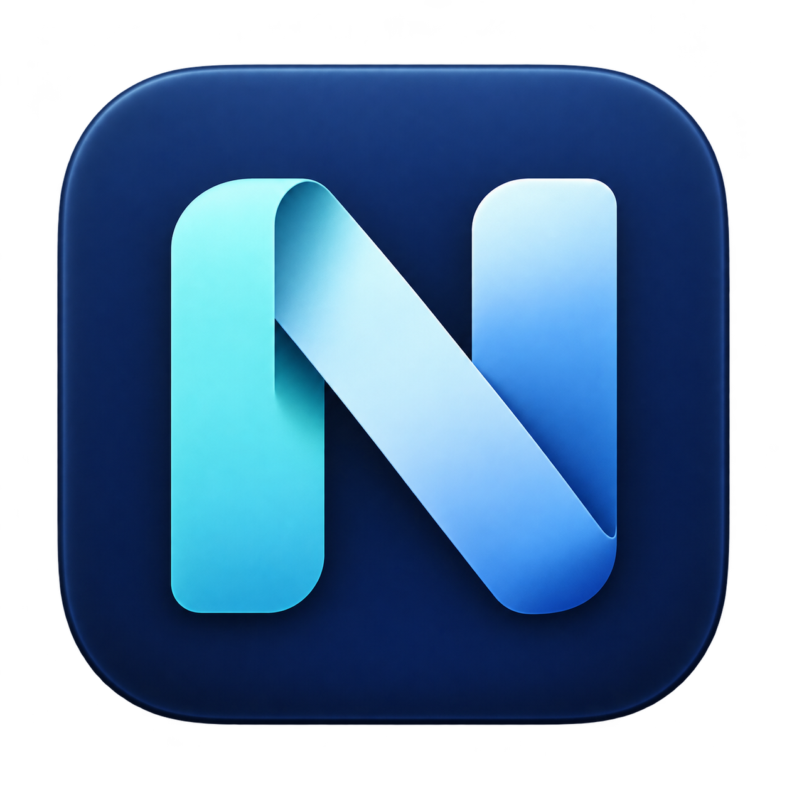

# Nivlet

  

把常用的 macOS 桌面功能放进菜单栏：剪贴板历史、系统信息、窗口调整、自动切换输入法，以及按规则选择浏览器。使用时无需另外安装 Hammerspoon，也无需编辑配置文件。

**目前是开发预览，仅提供源码，尚无可直接下载的正式安装包。** 自行构建请看 [构建说明](DEVELOPMENT.md)；已有开发版 App 的用户可按下方步骤使用。

## 开始使用

1. 将 `Nivlet.app` 放入“应用程序”文件夹并打开。只运行一份应用。
2. 点击菜单栏的**设置图标 → 设置…**，通过顶部标签进入对应功能。
3. 配置完成后点击该页的保存按钮。窗口管理、输入法规则、剪贴板记录和浏览器规则默认关闭，按需启用。

应用启动后会显示剪贴板图标 📋 和上下两行网速。剪贴板图标出现不代表已经开始记录，需先启用并保存。

窗口调整和 Option 直接粘贴需要在“系统设置 → 隐私与安全性 → 辅助功能”允许 Nivlet。其余下列功能无需这项权限。开发版更新后如果权限失效，可重新检查这个应用的授权。

## 菜单栏与外观

在“设置 → 通用”可隐藏或显示 Nivlet 主图标，默认显示。剪贴板和系统信息入口不受这个开关影响。隐藏主图标后，再次打开 `Nivlet.app` 即可进入设置；剪贴板和系统信息菜单也保留设置入口。

外观可选择“跟随系统／浅色／深色”，默认跟随系统，仅影响 Nivlet。菜单栏和系统菜单沿用 macOS 外观。应用不再显示内嵌 Runtime 的锤子菜单。

## 剪贴板：找回刚才复制的内容

1. 打开“设置 → 剪贴板”，勾选启用，按需选择记录图片，点击保存。
2. 在其他应用复制文字或图片，再点击菜单栏 📋 查看历史。
3. 点击一条历史将其复制，然后到目标应用粘贴。

| 想做什么 | 操作 |
| --- | --- |
| 查找文字 | 📋 → 搜索历史…，输入关键词；设置页右侧也可搜索 |
| 查看图片细节 | 在历史中点击“放大预览”，关闭后返回历史 |
| 直接粘贴 | 按住 Option 点击菜单历史，粘贴到打开菜单前的应用；需辅助功能权限 |
| 暂停记录 | 在剪贴板菜单暂停，恢复后只记录新的复制内容 |
| 清空历史 | 📋 → 清空历史…，确认后清空 |
| 调整记录数量和保留时间 | 设置页左侧修改并保存，右侧保留历史视图 |
| 用快捷键打开菜单 | 展开“可选：菜单快捷键”，配置并保存；默认留空 |

只记录启用后的新内容，不补录此前或暂停期间的复制。重复文字或相同编码的图片会移到最新位置。搜索支持文字内容，暂不识别图片里的文字。

默认退出应用后不保留历史。需要跨重启保留时，勾选“跨重启保留历史”并保存。缓存仅存本机，属于明文；关闭整个功能或清空历史会删除相应记录和缓存。复制敏感内容前建议暂停记录，应用排除和隐私过滤不能识别所有敏感内容。

文本数量可设为 10–100 条，保留时间 1–120 分钟；图片最多 10 张，每张约 10 MiB。文件复制不进入历史。直接粘贴图片需要目标应用支持图片。

## 系统信息：只显示你需要的项目

点击菜单栏网速查看系统信息。进入“设置 → 系统信息”，可分别控制网速、CPU、内存、磁盘、IPv4、IPv6、MAC、公历/星期和农历的显示，保存后立即生效。

隐藏网速后仍保留 ⓘ 入口，方便再次打开设置。点击菜单中的地址或日期可复制。当前展示本机信息，没有公网 IP 或位置查询。

## 窗口管理：配置自己的快捷键

在“设置 → 窗口管理”启用功能，为左半屏、右半屏、最大化、恢复原位置选择修饰键和一个字母或数字，然后保存。在普通应用窗口中按对应组合即可操作。

所有快捷键默认留空；清空某项按键并保存可解除该项绑定。恢复原位置只适用于本次运行中已调整的窗口，全屏窗口不支持。若提示冲突，请换用其他组合；部分第三方应用的快捷键占用无法检测。

## 输入法：不同应用使用不同输入法

在“设置 → 输入法”添加应用，选择该应用使用的输入法，启用后保存。下次切换到该应用时自动生效；未配置的应用保持当前输入法。可选项来自系统中已经启用的输入法。

## 浏览器：按域名或来源应用打开链接

例如，将某个网站交给 Chrome，将某个应用发出的其他链接交给 Safari。

1. 在“设置 → 浏览器”选择未匹配链接使用的默认目标浏览器。
2. 添加域名规则，填写 `example.com` 并选择浏览器；按需勾选“含子域名”。
3. 需要按来源分流时，点击“添加应用…”并为它选择浏览器。
4. 启用并保存，输入链接，通过“检查匹配”和“按规则打开”试用。可选择“模拟来源”检查应用规则。

优先顺序为 **域名规则 → 来源应用规则 → 默认目标**，域名规则按列表从上到下匹配，可用 ↑ / ↓ 调整顺序。支持已安装的 Safari、Chrome、Firefox、Edge 和 Brave，仅处理 HTTP/HTTPS 网页链接。

**其他应用的链接自动接管仍待完整验收。** 需要尝试时，在 macOS 的默认网页浏览器设置中手动选择 Nivlet，并保持它运行；取消时改回原浏览器。Nivlet 不会替你修改系统默认浏览器。来源应用无法识别时按域名及默认目标处理；冷启动首个链接也仍待验证。

## 常见问题

**复制后没有历史？** 检查是否启用并保存、是否暂停，再复制一次新内容。被排除的应用、文件复制或超出大小限制的内容不会记录；设置页可点击“刷新历史”。

**窗口快捷键或直接粘贴没有反应？** 检查 Nivlet 的辅助功能权限和快捷键设置，确认目标是普通窗口。开发版更新后可能需要重新授权。

**能替代我现有的 Hammerspoon 吗？** 当前仅实现上述功能，与个人配置和历史隔离；其他个人模块没有全部迁入。

**有截图工具吗？** 当前没有。截图后在选区原位置编辑、复制和保存属于后续讨论方案，尚未实现。

## 当前版本的边界

已在 Apple Silicon 开发环境完成分项验证；其他 macOS、Intel、多显示器及正式安装流程尚未全面验证。系统级浏览器接管仍待测试，不能将设置页手动打开链接通过视为全流程已验证。详细记录见 [VALIDATION.md](VALIDATION.md)。

## 源码与许可

源码：[jrchhoo/Nivlet](https://github.com/jrchhoo/Nivlet)。开发和测试请看 [DEVELOPMENT.md](DEVELOPMENT.md)。

Runtime 基于 Hammerspoon，其主项目使用 [MIT 许可证](https://github.com/Hammerspoon/hammerspoon/blob/1.1.1/LICENSE)。其他依赖各自保留许可；正式分发二进制前仍需完整第三方 notices。当前公开内容为项目源码和 patch。
